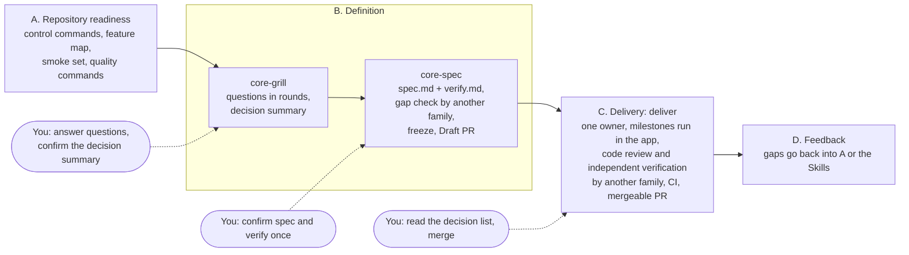

# dev-skills

[](https://github.com/coder-xieshijie/dev-skills/actions/workflows/check.yml)

English | [简体中文](README.zh-CN.md)

Production-grade Agent Skills: from requirement to a verified, mergeable pull request. You settle the decisions and acceptance criteria at the start and read the agent's decisions before you merge; in between, one agent does the work and proves it in the running app, and a model from another family checks it. The reasoning behind every rule, with links to the OpenAI, Anthropic and Lauren Tan (pstack) sources it rests on, is in [docs/basis.md](docs/basis.md).

**Status:** versioned releases ([changelog](CHANGELOG.md)), used on real features in a production codebase, with CI checks on every pull request.

## The workflow



| Stage | Skill | What the agent does | What you do |
|---|---|---|---|
| A. Repository readiness | Your project's own verification setup ([guide](docs/repository-readiness.md)) | Makes the app startable, drivable and observable from a worktree: control commands, a feature map, a smoke set, quality commands | Build it once per repository, then extend it as needed |
| B. Definition | [core-grill](skills/core-grill/SKILL.md) → [core-spec](skills/core-spec/SKILL.md) | Asks in rounds and writes a decision summary; brings the related feature map in line with the product; writes spec.md and verify.md and has another model family check them clause by clause; after freezing, commits them to the feature branch and opens a Draft PR (MR on GitLab) | Answer the questions; confirm the decision summary once; confirm spec and verify once |
| C. Delivery | [deliver](skills/deliver/SKILL.md) | One owner works without stopping: has another family preview how the final verification will judge the plan; implements milestone by milestone and runs the scenarios in the app; has another family review the code read-only, fixes one round, then runs its full self-verification while another family verifies independently; handles CI and review until the PR is mergeable; asks another family before decisions and lists them at the top of plan.md and the PR | Read the decision list before merging, then merge |
| D. Feedback | — | Lists the repository gaps this run exposed, in the PR and plan.md | Decide which go back into stage A or the Skills |

Rules that hold throughout:

- **Constraints at both ends.** The definition stage settles every decision a person must make and every acceptance requirement; at the end, another model family verifies against verify's done criteria. In between, the owner works on its own; disagreements go into the decision list instead of stopping the work, and you review them before merging.
- **Irreversible operations are yours.** Merging, force-pushing a shared branch, deleting shared data, sending messages outside, changing a shared environment. The agent finishes everything else, and writes down why for anything it cannot do.
- **Checks go to another model family.** The gap check of spec and verify, the preview at the start of delivery, decisions during delivery, the code review before the final verification and the final verification itself all run in a new session of a model from another family ([cross-model calls](skills/core-spec/references/cross-model.md)).
- **Check results, not process.** Scripts check two things: spec and verify are the versions you confirmed, and the final code passed verification by another family. Everything else is stated in text and left to the model's judgment.

## Requirements

- **Two model families.** CLIs for models from two different families, installed and logged in; by default [Claude Code](https://code.claude.com/docs) and [Codex](https://developers.openai.com/codex), and any other CLI that runs another family's model and can write its reply to a file also works ([cross-model calls](skills/core-spec/references/cross-model.md)). You can also work in MCode, MiniMax's coding agent, which runs the model you configure in it; the checks then go to whichever of these CLIs runs a different family. The gap check and the final verification need a model from a family other than the one doing the work; with only one family available, the workflow stops there instead of checking with the same family.
- **Node.js 24** for the scripts, **git**, and the platform CLI for PRs: `gh` for GitHub or `glab` for GitLab.
- **An app agents can drive.** Agents must be able to start, operate and observe the app from a worktree, at the entry points users use. See [Repository readiness](docs/repository-readiness.md).

## Install

In Claude Code and Codex, core-spec supports both manual invocation and automatic selection by the agent after discussion and clarification are finished, including after the user confirms core-grill's decision summary. core-grill and the other Skills are manual-only. MCode does not read the manual-only setting yet, so it may also load those Skills when a request matches their descriptions; call the Skills by name to be sure which one runs.

**MCode** (plugin, imported from Git): in the desktop app, open the Plugins page, choose **Create → Import from a Git repository**, paste `https://github.com/coder-xieshijie/dev-skills`, then **Preview** and **Import**. MCode imports one plugin at a time and does not read marketplace files; it reads the plugin manifest at the repository root and every Skill under `skills/`. Plugin Skills are namespaced: call them as `/dev-skills:core-grill`, `/dev-skills:core-spec` and so on.

**Claude Code** (plugin):

```bash
claude plugin marketplace add coder-xieshijie/dev-skills
claude plugin install dev-skills@dev-skills
```

Inside a session the same commands are `/plugin marketplace add coder-xieshijie/dev-skills` and `/plugin install dev-skills@dev-skills`. Plugin Skills are namespaced: call them as `/dev-skills:core-grill`, `/dev-skills:core-spec` and so on. Third-party marketplaces do not update on their own; to get a newer version, run `claude plugin marketplace update dev-skills` and then `claude plugin update dev-skills@dev-skills`. To uninstall, run `claude plugin uninstall dev-skills@dev-skills` and `claude plugin marketplace remove dev-skills`.

**Codex** (plugin, reads the same marketplace file):

```bash
codex plugin marketplace add coder-xieshijie/dev-skills
codex plugin add dev-skills@dev-skills
```

Call the Skills as `$dev-skills:core-grill` and so on. Run `codex plugin marketplace upgrade dev-skills` to get a newer version. To uninstall, run `codex plugin remove dev-skills@dev-skills` and `codex plugin marketplace remove dev-skills`.

Claude Code pins the plugin to the version in [.claude-plugin/plugin.json](.claude-plugin/plugin.json): an install stays on that version until it is raised, and the update commands above then fetch the new one. [CHANGELOG.md](CHANGELOG.md) lists the changes in each version.

**From a clone** (for working on the Skills, or for other agents): link each Skill directory into the Skills directories the clients read: `~/.agents/skills` for Codex and MCode, `~/.claude/skills` for Claude Code. The Skills refer to each other by relative paths (deliver reads `../core-spec/references/cross-model.md`), so link all of them side by side:

```bash
git clone https://github.com/coder-xieshijie/dev-skills.git
mkdir -p ~/.agents/skills ~/.claude/skills
for s in dev-skills/skills/*/; do
  ln -sfn "$PWD/$s" ~/.agents/skills/"$(basename "$s")"
  ln -sfn ~/.agents/skills/"$(basename "$s")" ~/.claude/skills/"$(basename "$s")"
done
```

Called this way, the Skills have no namespace (`/core-grill`, `$core-grill`). Use either the plugin or the links, not both, or each Skill shows up twice.

Other agents that read the [Agent Skills format](https://agentskills.io/specification), one directory per Skill with a `SKILL.md`, can use the same clone: link the Skill directories side by side into that agent's Skills directory. The plugin installs cover MCode, Claude Code and Codex; the Skills have been tested end to end only in Claude Code and Codex.

## A complete run

1. In the target repository: `/dev-skills:core-grill The requirement is <link or text>; put the requirement documents in <requirement directory>/`. Answer the questions and confirm the decision summary.
2. In the same session: `/dev-skills:core-spec Write spec.md and verify.md from the decision summary`. Read the gap check result and confirm spec and verify. It commits them to the feature branch and opens a Draft PR.
3. In a new session: `/dev-skills:deliver Take over <Draft PR link>`. When it says the PR can be merged, read the decision list at the top of the PR, then merge.

The commands above work as written in MCode and Claude Code; in Codex, write `$dev-skills:` instead of `/dev-skills:`. By default, questions, the decision summary and spec follow the language of your request, and verify, plan.md, the decision list and the PR description follow spec.md; you or the repository's documentation rules can ask for another language.

## Skills

| Skill | What it does |
|---|---|
| [core-grill](skills/core-grill/SKILL.md) | At the start of a requirement, asks in rounds about the decisions that change user-visible results (for refactoring or slimming, about scope and the expected gain), records terms, and hands a decision summary you confirmed to core-spec |
| [core-spec](skills/core-spec/SKILL.md) | Turns the discussion into spec.md (decisions and constraints) and verify.md (acceptance requirements for automated delivery), has another family gap-check them, and freezes them after one confirmation. Can also produce only a spec |
| [deliver](skills/deliver/SKILL.md) | From the frozen spec and verify, one owner implements, verifies each milestone in the app, gets independent verification by another family, and takes the PR through CI to mergeable, listing its decisions at the top |
| [review-rules](skills/review-rules/SKILL.md) | Criteria for code and design review, for re-checking findings and for judging fixes: reuse, necessary change, complexity, extensibility, ownership |
| [mr-for-human](skills/mr-for-human/SKILL.md) | Turns a PR into a reading guide for people: core conclusions, design, execution logic in pseudocode, runtime constraints, where to find the code |
| [explain-as-fool](skills/explain-as-fool/SKILL.md) | Explains a topic to someone who knows nothing about it; other Skills reuse its writing rules |
| [design-for-review](skills/design-for-review/SKILL.md) | Turns requirements and design material into a self-contained technical review document |
| [plan-for-agents](skills/plan-for-agents/SKILL.md) | Creates, revises or checks a complete plan for agents to execute, from requirements and confirmed decisions to steps, outputs and acceptance evidence |
| [agent-prompt-rules](skills/agent-prompt-rules/SKILL.md) | Rules, each linked to Anthropic and OpenAI sources, for writing and reviewing prompts for agents, multi-agent pipelines and SKILL.md files |
| [recon-to-contract](skills/recon-to-contract/SKILL.md) | Converges a comparison of two or more external references into one executable contract with evidence, decisions and acceptance criteria |

The development workflow uses core-grill, core-spec, deliver, review-rules, mr-for-human and explain-as-fool; the others can be used on their own.

## Documentation

- [Why the workflow looks the way it does](docs/basis.md): the three sources, where they agree and disagree, what this workflow adds, and a rule-by-rule basis for core-grill, core-spec and deliver.
- [Repository readiness](docs/repository-readiness.md): what stage A needs, with [templates](docs/templates/) and an [example](docs/examples/feature-map-example.md).
- [Glossary](docs/glossary.md): the terms the Skills use, with their Chinese equivalents.
- Design records, in Chinese: [core-grill](docs/core-grill-design.md), [core-spec](docs/core-spec-design.md), [deliver](docs/deliver-design.md), [mr-for-human](docs/mr-for-human-design.md) and its [validation](docs/mr-for-human-validation.md).

## Working on the Skills

- Each Skill lives in `skills/<skill-name>/` with `SKILL.md` as its entry point, plus `scripts/`, `references/` or `assets/` when it needs them. `name` matches the directory name; the directory names are stable because other tools refer to them by path.
- Skill text is English, using the terms in the [glossary](docs/glossary.md); see [AGENTS.md](AGENTS.md). Changes to rules follow [agent-prompt-rules](skills/agent-prompt-rules/SKILL.md): one component at a time, with the basis recorded, compared in a new session.
- CI runs the link and anchor checks and the script tests: `node scripts/check-links.mjs`, `node skills/agent-prompt-rules/scripts/check-links.mjs`, `node --test skills/agent-prompt-rules/scripts/check-links.test.mjs`, `node --test skills/deliver/scripts/check-delivery.test.mjs` and `node --test skills/core-spec/scripts/clauses.test.mjs`.
- `skills/agent-prompt-rules/references/sources/` keeps verbatim excerpts of the vendor documents the rules cite; [its README](skills/agent-prompt-rules/references/sources/README.md) says how to update them.

## Feedback

Report how a Skill behaved, or a problem with installing it, in [Issues](https://github.com/coder-xieshijie/dev-skills/issues/new/choose). Ask questions and suggest changes in [Discussions](https://github.com/coder-xieshijie/dev-skills/discussions). [CONTRIBUTING.md](CONTRIBUTING.md) says what a useful report contains and how to change a Skill.

## License

[MIT](LICENSE). Third-party material and its licenses: [THIRD_PARTY_NOTICES.md](THIRD_PARTY_NOTICES.md).
