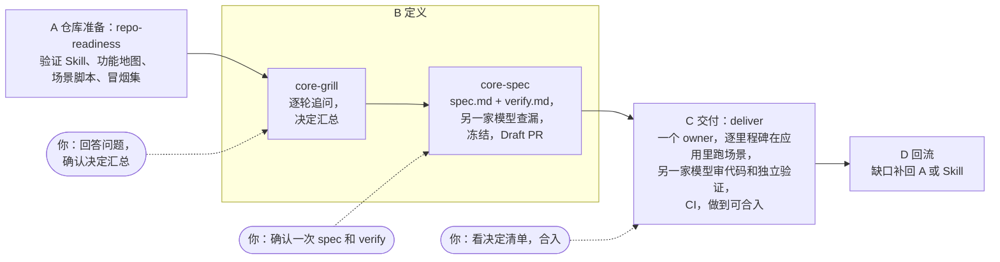

# dev-skills

[](https://github.com/coder-xieshijie/dev-skills/actions/workflows/check.yml)

[English](README.md) | 简体中文

生产级 Agent Skills：把需求做成验证过、可合入的 PR。决定和验收标准由你在开头定下，合入前看 agent 做过的决定；中间由一个 agent 完成工作，在运行的应用里证明结果，再由另一家模型复核。每条规则背后的理由，以及它依据的 OpenAI、Anthropic 和 Lauren Tan（pstack）原文，见 [docs/basis.md](docs/basis.md)（英文）。

**现状：**按版本发布（见 [CHANGELOG](CHANGELOG.md)），已用于生产代码库的真实需求，每个 PR 都跑 CI 检查。

## 开发流程



| 阶段 | Skill | agent 做什么 | 你做什么 |
|---|---|---|---|
| A 仓库准备 | [repo-readiness](skills/repo-readiness/SKILL.md) 搭建项目自己的验证 Skill（[指南](docs/repository-readiness.md)，英文） | 让 agent 能在 worktree 里启动、操作、观察应用：每个入口隔离的控制命令、带判据编号的功能地图、场景脚本、冒烟集、CI 里的结构检查 | 回答仓库里查不到的（下一个需求、用户实际用的入口、哪些不能碰）；每个仓库建一次，之后按需补 |
| B 定义 | [core-grill](skills/core-grill/SKILL.md) → [core-spec](skills/core-spec/SKILL.md) | 逐轮追问，整理决定汇总；相关功能地图先与产品对齐；写 spec.md 和 verify.md，请另一家模型逐条款查漏；冻结后提交到需求分支，开 Draft PR（GitLab 上叫 MR） | 回答问题；确认一次决定汇总；确认一次 spec 和 verify |
| C 交付 | [deliver](skills/deliver/SKILL.md) | 一个 owner 全程不停：开工时请另一家模型预判最终验证怎样判这份 plan；逐个里程碑实现并在应用里跑场景；另一家模型先只读审代码，owner 修一轮，再与 owner 的全量自验同时做独立验证；处理 CI 和评审，做到可合入；要定的事先问另一家模型，决定列在 plan.md 和 PR 描述最前面 | 合入前看决定清单，合入 |
| D 回流 | — | 在 PR 和 plan.md 里列出这次暴露的仓库缺口 | 决定哪些补回 A 阶段或 Skill |

几条贯穿全程的约定：

- **约束放在两端。** 定义阶段把要人决定的事和验收要求定全；结尾由另一家模型按 verify 的完成条件验证。中间交给 owner 自己完成，有分歧记进决定清单、不停下，合入前交给你看。
- **不可逆操作留给你。** 合入、强推共享分支、删除共享数据、对外发消息、改共享环境。其余工作 agent 自己做完，做不了的写明原因。
- **检查交给另一家模型。** spec 和 verify 的查漏、交付开工时的预判、交付中的决定、最终验证前的代码审查和最终验证，都请另一家模型在新 session 里做（[跨模型调用](skills/core-spec/references/cross-model.md)）。
- **查结果，不查过程。** 脚本只核对两件事：spec、verify 是你确认的版本；最终代码由另一家模型验证通过。其余由说明文字约定，交给模型判断。

## 前提

- **两家模型。** 两个不同家族模型的 CLI，都装好并登录；默认是 [Claude Code](https://code.claude.com/docs) 和 [Codex](https://developers.openai.com/codex)，其他能调用另一家模型、能把回复写进文件的 CLI 也可以（[跨模型调用](skills/core-spec/references/cross-model.md)）。也可以在 MCode（MiniMax 的 coding agent）里工作，它运行你在其中配置的模型；检查交给上面 CLI 中与它不同家族的那一个。查漏和最终验证要用与干活的模型不同家族的模型；只有一家可用时，流程会停在那一步，不会降级成同家族检查。
- **Node.js 24**（运行脚本）、**git**，以及开 PR 用的平台 CLI：GitHub 用 `gh`，GitLab 用 `glab`。
- **agent 能驱动的应用。** agent 要能在 worktree 里从用户实际使用的入口启动、操作、观察应用。[repo-readiness](skills/repo-readiness/SKILL.md) 每个仓库搭一次；各部分为什么需要，见[仓库准备](docs/repository-readiness.md)。

## 安装

在 Claude Code 和 Codex 里，core-spec 既支持手动调用，也支持 Agent 在讨论和澄清完成后主动触发，包括用户确认 core-grill 的决定汇总后。core-grill 和其他 Skill 只支持手动调用。MCode 目前不读仅手动调用的设置，请求和描述对得上时也可能自动加载这些 Skill；要确定用的是哪个，就按名字调用。

**MCode**（插件，从 Git 导入）：在桌面应用里打开插件页，选择 **Create → Import from a Git repository**（中文界面为“创建 → 从 Git 仓库导入”），粘贴 `https://github.com/coder-xieshijie/dev-skills`，再点 **Preview**、**Import**。MCode 一次导入一个插件，不读 marketplace 文件；它读取仓库根目录的插件清单和 `skills/` 下的所有 Skill。插件里的 Skill 带命名空间，调用写成 `/dev-skills:core-grill`、`/dev-skills:core-spec` 等。

**Claude Code**（插件）：

```bash
claude plugin marketplace add coder-xieshijie/dev-skills
claude plugin install dev-skills@dev-skills
```

在会话里对应的命令是 `/plugin marketplace add coder-xieshijie/dev-skills` 和 `/plugin install dev-skills@dev-skills`。插件里的 Skill 带命名空间，调用写成 `/dev-skills:core-grill`、`/dev-skills:core-spec` 等。第三方 marketplace 不会自动更新，取新版本先运行 `claude plugin marketplace update dev-skills`，再运行 `claude plugin update dev-skills@dev-skills`。卸载运行 `claude plugin uninstall dev-skills@dev-skills` 和 `claude plugin marketplace remove dev-skills`。

**Codex**（插件，读同一份 marketplace 文件）：

```bash
codex plugin marketplace add coder-xieshijie/dev-skills
codex plugin add dev-skills@dev-skills
```

调用写成 `$dev-skills:core-grill` 等。取新版本运行 `codex plugin marketplace upgrade dev-skills`。卸载运行 `codex plugin remove dev-skills@dev-skills` 和 `codex plugin marketplace remove dev-skills`。

Claude Code 会把插件固定在 [.claude-plugin/plugin.json](.claude-plugin/plugin.json) 里的版本：装好后一直停在这个版本，版本号提高后，用上面的更新命令取新版本。每个版本的变化见 [CHANGELOG.md](CHANGELOG.md)（英文）。

**从克隆安装**（用于修改 Skill，或给其他 agent 用）：把每个 Skill 目录链接到各客户端读取的 Skill 目录：Codex 和 MCode 读 `~/.agents/skills`，Claude Code 读 `~/.claude/skills`。Skill 之间用相对路径互相引用（例如 deliver 读 `../core-spec/references/cross-model.md`），所以要全部并排链接：

```bash
git clone https://github.com/coder-xieshijie/dev-skills.git
mkdir -p ~/.agents/skills ~/.claude/skills
for s in dev-skills/skills/*/; do
  ln -sfn "$PWD/$s" ~/.agents/skills/"$(basename "$s")"
  ln -sfn ~/.agents/skills/"$(basename "$s")" ~/.claude/skills/"$(basename "$s")"
done
```

这样调用时没有命名空间（`/core-grill`、`$core-grill`）。插件和链接二选一，两者都装时每个 Skill 会出现两次。

其他支持 [Agent Skills 格式](https://agentskills.io/specification)（每个 Skill 一个目录，内含 `SKILL.md`）的 agent，也可以用同一份克隆：把各个 Skill 目录并排链接到该 agent 的 Skill 目录。插件安装支持 MCode、Claude Code 和 Codex；端到端测试目前只在 Claude Code 和 Codex 上做过。

## 一次完整的用法

每个仓库在第一个需求之前做一次：`/dev-skills:repo-readiness 下一个需求是 <链接或原文>`。它先从代码里回答能回答的，其余一次问你，最后提交验证 Skill 和第一批功能地图。

1. 在目标仓库里：`/dev-skills:core-grill 需求是 <链接或原文>，需求文档放 <需求目录>/`。回答问题，确认决定汇总。
2. 同一个 session 里：`/dev-skills:core-spec 依据决定汇总写 spec.md 和 verify.md`。看查漏结果，确认 spec 和 verify；它会提交到需求分支并开 Draft PR。
3. 新开一个 session：`/dev-skills:deliver 接手 <Draft PR 链接>`。等它说可以合入，看 PR 最前面的决定清单，再合入。

上面的命令在 MCode 和 Claude Code 里照写即可；Codex 里把 `/dev-skills:` 换成 `$dev-skills:`。默认情况下，问题、决定汇总和 spec 用你提需求时的语言，verify、plan.md、决定清单和 PR 描述跟随 spec.md 的语言；你或仓库的文档规则可以另行指定。

## Skill 列表

| Skill | 用途 |
|---|---|
| [repo-readiness](skills/repo-readiness/SKILL.md) | 在一个仓库里搭好 agent 验证：项目内的验证 Skill（每个入口隔离的控制命令）、带判据编号的功能地图、场景脚本与 runner、反例对照，以及 CI 里的结构检查 |
| [core-grill](skills/core-grill/SKILL.md) | 需求起步时逐轮追问会改变用户可见结果的决定（重构、瘦身类需求改问范围和预期收益），写好术语，把你确认的决定汇总交给 core-spec |
| [core-spec](skills/core-spec/SKILL.md) | 把讨论收敛成 spec.md（决定与约束）和 verify.md（自动交付的验收要求），请另一家模型查漏，一次确认后冻结。也可以只产出 spec |
| [deliver](skills/deliver/SKILL.md) | 依据冻结的 spec 和 verify，由一个 owner 实现、逐里程碑在应用里验证、请另一家模型独立验证，并把 PR 做到 CI 通过、可合入；自己做的决定列在最前面 |
| [review-rules](skills/review-rules/SKILL.md) | 代码与设计评审、复核问题、判断修复方案时用的准则：复用、必要改造、复杂度、扩展性、责任边界 |
| [mr-for-human](skills/mr-for-human/SKILL.md) | 把 PR 整理成给人看的阅读指南：核心结论、设计、伪代码表示的执行逻辑、运行约束、代码定位 |
| [explain-as-fool](skills/explain-as-fool/SKILL.md) | 面向对话题一无所知的人做解释；其他 Skill 复用它的写作要求 |
| [design-for-review](skills/design-for-review/SKILL.md) | 把需求和设计材料整理成可独立阅读的技术评审文档 |
| [plan-for-agents](skills/plan-for-agents/SKILL.md) | 创建、修订或检查供 agent 执行的完整计划，从需求和已确认决定落到步骤、产物和验收证据 |
| [agent-prompt-rules](skills/agent-prompt-rules/SKILL.md) | 写和审查给 agent 的 prompt、多 agent pipeline 与 SKILL.md 的规则，每条都链接到 Anthropic、OpenAI 原文 |
| [recon-to-contract](skills/recon-to-contract/SKILL.md) | 把两个以上外部参照物的对标调研收敛成一份有证据、有决定、有验收标准的可执行契约 |

开发流程用到 repo-readiness、core-grill、core-spec、deliver、review-rules、mr-for-human 和 explain-as-fool；其余可以单独使用。

## 文档

- [流程为什么是这个样子](docs/basis.md)（英文）：三家来源、它们的共识与分歧、本流程自己加的东西，以及 core-grill、core-spec、deliver 逐条规则的依据。
- [仓库准备](docs/repository-readiness.md)（英文）：A 阶段需要什么、为什么，来自我们第一次搭建，附当时的[模板](docs/templates/)和[示例](docs/examples/feature-map-example.md)。[repo-readiness](skills/repo-readiness/SKILL.md) Skill 带有当前的地图格式和可运行的 kit；两者的差异列在指南里。
- [术语表](docs/glossary.md)：Skill 用到的术语，附中文对照。
- 设计记录（中文）：[core-grill](docs/core-grill-design.md)、[core-spec](docs/core-spec-design.md)、[deliver](docs/deliver-design.md)、[mr-for-human](docs/mr-for-human-design.md) 及其[验证记录](docs/mr-for-human-validation.md)。

## 修改 Skill

- 每个 Skill 放在 `skills/<skill-name>/`，入口是 `SKILL.md`，需要时再加 `scripts/`、`references/` 或 `assets/`。`name` 与目录名一致；其他工具按路径引用这些目录，目录名不改。
- Skill 正文用英文写，术语按[术语表](docs/glossary.md)；见 [AGENTS.md](AGENTS.md)。改规则按 [agent-prompt-rules](skills/agent-prompt-rules/SKILL.md)：一次改一个组件，记下依据，在新 session 里对照。
- CI 运行链接与锚点检查和脚本测试：`node scripts/check-links.mjs`、`node skills/agent-prompt-rules/scripts/check-links.mjs`、`node --test skills/agent-prompt-rules/scripts/check-links.test.mjs`、`node --test skills/deliver/scripts/check-delivery.test.mjs`、`node --test skills/core-spec/scripts/clauses.test.mjs`、`node --test skills/repo-readiness/assets/verify-skill/scripts/test/*.test.mjs`。
- `skills/agent-prompt-rules/references/sources/` 保存规则引用的厂商文档的逐字摘录；怎样更新见[它的 README](skills/agent-prompt-rules/references/sources/README.md)。

## 反馈

Skill 的实际表现或安装问题，请在 [Issues](https://github.com/coder-xieshijie/dev-skills/issues/new/choose) 里反馈；提问和建议请到 [Discussions](https://github.com/coder-xieshijie/dev-skills/discussions)。反馈要写哪些信息、怎样修改 Skill，见 [CONTRIBUTING.md](CONTRIBUTING.md)（英文）。

## 许可

[MIT](LICENSE)。第三方内容及其许可见 [THIRD_PARTY_NOTICES.md](THIRD_PARTY_NOTICES.md)。
